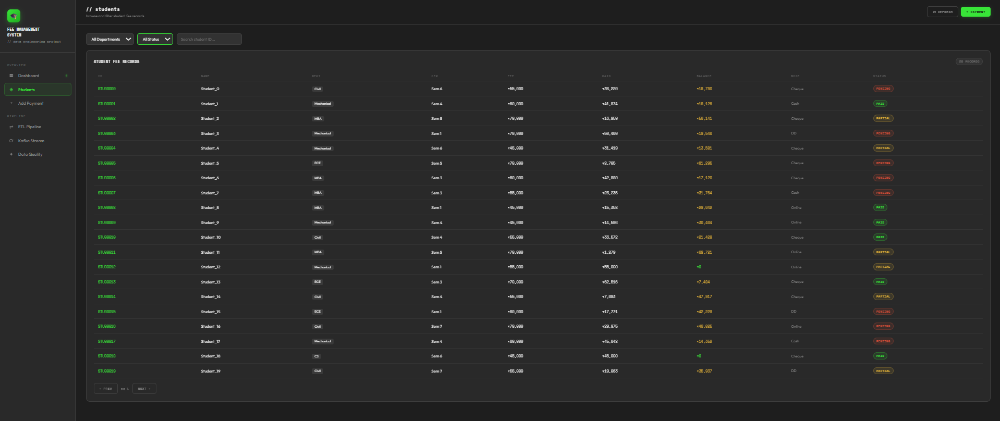
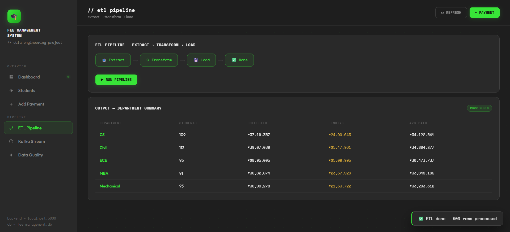
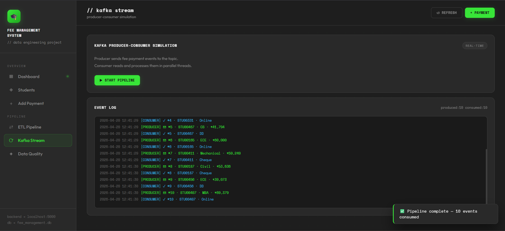

# University Fee Management System

A full-stack data engineering project that simulates a real-world university fee system with dashboard analytics, ETL pipeline, Kafka streaming, and data quality checks.

---

## Features

* Interactive dashboard with real-time statistics
* Student fee records with filtering and pagination
* Payment recording system
* ETL pipeline simulation (Extract → Transform → Load)
* Kafka producer-consumer simulation
* Data quality validation and scoring

---

## Tech Stack

### Frontend

* HTML, CSS, JavaScript
* Live Server (VS Code)

### Backend

* Python (Flask)
* SQLite database
* Pandas and NumPy

---

## Setup Instructions

### 1. Clone the repository

```bash
git clone https://github.com/your-username/fee-management-system.git
cd fee-management-system
```

---

### 2. Backend Setup

```bash
cd backend
pip install -r requirements.txt
python app.py
```

Server runs on:

```
http://127.0.0.1:5000
```

---

### 3. Frontend Setup

* Open `frontend/index.html`
* Right-click → Open with Live Server

---

## API Endpoints

* `/api/dashboard`
* `/api/students`
* `/api/add-payment`
* `/api/run-etl`
* `/api/kafka-simulate`
* `/api/data-quality`

---

## Screenshots





---

## Future Improvements

* Deploy on cloud platforms (AWS / Render)
* Add authentication (JWT)
* Replace SQLite with PostgreSQL
* Integrate real Kafka instead of simulation

---

## Author

Abhinav Walde
